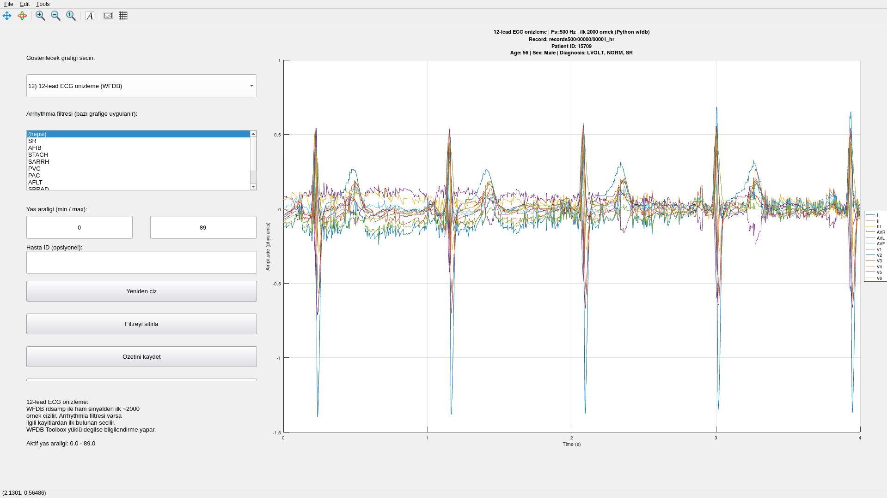

# Arrhythmia Detection (PTB-XL, MATLAB / GNU Octave)

Metadata-first exploration of the PTB-XL ECG dataset with lightweight classical models, an Octave dashboard, and optional raw signal preview through WFDB.

Presentation: https://presentations.bariscanatakli.com/ptbxl/ (offline: open `presentation.html` locally; no external assets required)

## What you get
- Fast metadata EDA (age/sex distributions, class balance, SCP co-occurrence) saved as PNGs under `analysis_results/`.
- Interactive Octave dashboard with filters (age range, sex, arrhythmia class) and patient-level summaries.
- Optional signal preview in the dashboard when WFDB is installed.
- Simple metadata-only baseline (`ptbxl_simple_model`) for NORM vs non-NORM separation.

## Prerequisites
- MATLAB R2021b+ **or** GNU Octave 6+  
- Octave `io` package (for CSV parsing)  
- PTB-XL dataset unpacked under `dataset/physionet.org/files/ptb-xl/1.0.3/` (must include `ptbxl_database.csv` and at least one of `records100/` or `records500/`)  
- Optional: WFDB Toolbox (MATLAB/Octave) to enable raw signal preview via `rdsamp`

Dataset layout:
```
dataset/
  physionet.org/files/ptb-xl/1.0.3/
    ptbxl_database.csv
    records100/
    records500/
    scp_statements.csv
```
- If your dataset lives elsewhere, set `PTBXL_BASE=/custom/path/to/ptb-xl/1.0.3` before running any Octave scripts.
- All Octave entry points auto-detect the dataset location with `ptbxl_autodetect_base` and report missing pieces (`ptbxl_database.csv`, `scp_statements.csv`, `records100`/`records500`) clearly.

## Quick start (Octave / MATLAB)
From the repo root:
```octave
addpath('octave'); pkg load io;   % in MATLAB omit pkg load
ptbxl_data_analysis              % summary + figures saved to analysis_results/
% graphics_toolkit qt; ptbxl_dashboard  % interactive dashboard (Octave GUI)
```
- `ptbxl_data_analysis` prints dataset stats (records/patients, age range, sex split, missing values) and saves PNGs for age/sex/arrhythmia distributions plus SCP co-occurrence.
- `ptbxl_dashboard` mirrors the plots with GUI filters and patient-level summaries; when WFDB is available it also previews raw ECG signals.

## Optional: enable WFDB signal preview in the dashboard
1) Install the MATLAB/Octave WFDB Toolbox (the legacy PhysioNet URL is dead; download the archive manually and copy it to your machine).  
2) Unpack it somewhere you control, e.g. `unzip wfdb-app-toolbox.zip -d ~/opt/wfdb-toolbox`.  
3) In Octave/MATLAB before launching the dashboard:
```octave
addpath(genpath('~/opt/wfdb-toolbox'));
setenv('WFDBROOT', getenv('WFDB'));   % WFDB should point to your WFDB C install, e.g. ~/opt/wfdb
wfdbloadlib;                          % initialize the toolbox
```
4) Verify `rdsamp` works (e.g., `rdsamp('/path/to/ptb-xl/1.0.3/records100/00000/00001_lr')`).  
If WFDB is not present, the dashboard skips signal preview gracefully; if Python `wfdb` is installed, it attempts that as a fallback.

## Install notes (Octave)
- Debian/Ubuntu/WSL: `sudo apt-get update && sudo apt-get install -y octave`
- macOS (Homebrew): `brew install octave`
- Windows: prefer MATLAB or install Octave inside WSL.
- Confirm with `octave --version` and then run the quick start above.

## Key MATLAB/Octave utilities
- `ptbxl_data_analysis`: end-to-end summary plus saved figures.
- `ptbxl_dashboard`: interactive filters, patient summaries, optional WFDB signal preview.
- `ptbxl_basic_eda`: age/sex distributions, normal vs abnormal split, top arrhythmia counts.
- `ptbxl_advanced_plots`: arrhythmia age stats, arrhythmia sex distribution, SCP co-occurrence heatmap.
- `ptbxl_simple_model`: metadata-only logistic regression baseline.
- `ptbxl_patient_eda`: patient-level counts and arrhythmia prevalence summaries.

## Outputs and layout
- Generated assets land in `analysis_results/` (PNGs and text summaries).
- Source code lives in `octave/`.
- Presentation for talks is shipped as `presentation.html` (open locally for offline use).
- Legacy Python artifacts remain only for reference (`best_model.keras`, `data_analysis.ipynb`, `model_test/` images); training/testing scripts are intentionally absent in this MATLAB/Octave-focused branch.

## Dashboard preview
WFDB-enabled dashboard capture (signal preview on the right):  

